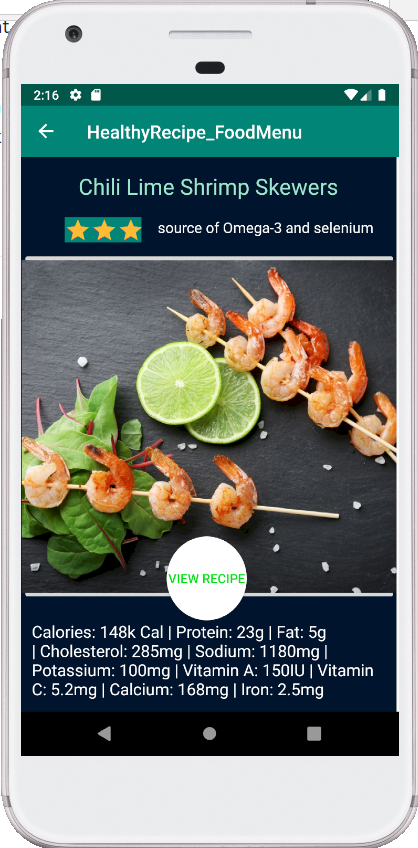
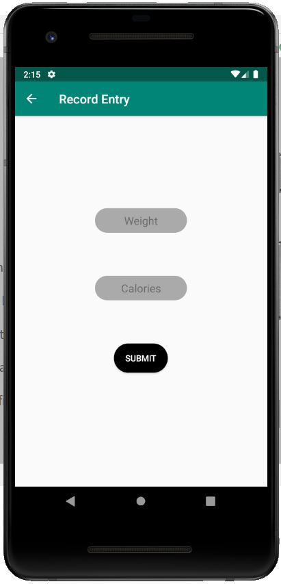
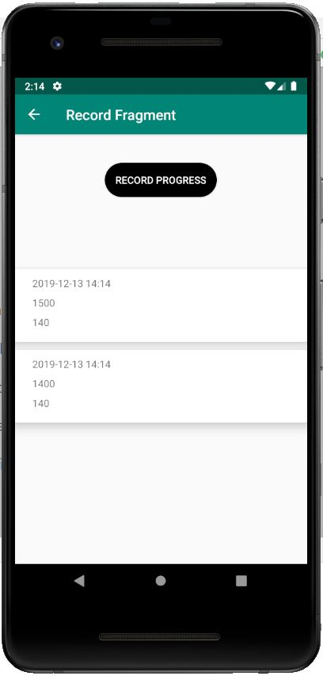

# Diet-Android-App
First Document 

## Introduction:
The reason why we decided to make a Diet Application is because there are many out there. Because we can take ideas from existing apps, we wanted to see what we could do to create an Android application with our own knowledge, and add our own spin on it.

The purpose of the Calorie Counter Fragment is to provide a way for users to register what they have eaten throughout the day and track at
what time they ate to ensure that users know what they are eating to promote healthier living.

The purpose of healthy recipe fragment is to provide users with some good recipes so that they can easily follow and learn how to make healthy foods

The purpose of the weight progress fragment is to allow users to track their weight by entering logs into the dieting app.

The purpose of the notification fragment is to allow the user to schedule a notification to remind them what times they should eat.

## Motivation:
Most diet apps restrict you on what you can track and sometimes provide too many options on what to track for certain foods, the calorie fragment is meant to provide a very simple way for users to enter what they ate and record at what time of the day they ate in order to provide a simple tracking of calories.

Healthy recipe fragment provides nice looking and easy-to-learn meals to ensure users are motivated to maintain a healthy diet.

The record tracker fragment allows users to pick up on good eating trends by observing the logs in the fragment and following good habits to facilitate weight loss or muscle gain.

There are diets that restrict the person on the diet from eating within certain hours, with a scheduled notification, we they can set a schedule of when they are allowed to eat.

## Code style:

Kotlin was used to make all the files associated with the calorie fragment. Here are three of the major tools we used to implement the app.

Room was used to implement the food diary and record tracker part of the app.

Data binding was used to implement most of the fragments that were part of the MVVM architecture part of the app.

RecyclerView was used to implement Record Tracker and Food Diary.

## Features:
The calorie fragment provides a easy to use interface that allows users to simply to click on a button that takes them to a entry
point and lets users enter what they ate and then see at what time the food was eaten.

The Healthy Recipe Fragment provides the healthy food recipes that can help users to reach and maintain healthy weight and reduce risk of diseases. User can easily learn how to make the food and buy the ingredients by clicking them. (For healthy drink just click the picture)

The record tracker fragment is an interface for users to observe logs they have previously input to the app. Record tracker extends to the record entry fragment which allows users to input their current weight and calories consumed on that day. The app will automatically attach a timestamp on each record in year month day format.

The reminder(notification) fragment is an interface that allows the user to use a dropdown menu with set times to schedule a notification to pop up after a certain time has passed.

## Screenshots

## Some Libraries Used
1. Room: https://developer.android.com/topic/libraries/architecture/room
2. Recyclerview: https://developer.android.com/reference/android/support/v7/widget/RecyclerView
3. LifeCycle: https://developer.android.com/topic/libraries/architecture/lifecycle
4. HelloCharts: https://github.com/lecho/hellocharts-android

Kevin Delao: Calorie Counter Fragment, AddFoodFragment, FoodOverview Fragment

Yilin Ruan: Healthy Food Recipe

Kuong Thong: Notifications

Nicholas Torres: Records Fragment

Thyagu Gowda: Exercise Fragment
