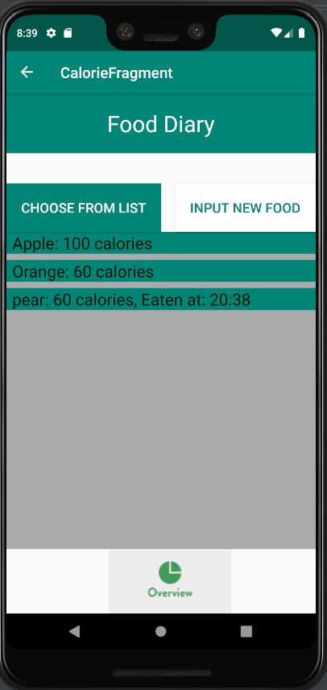
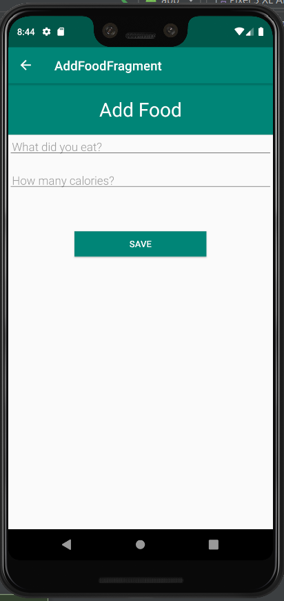
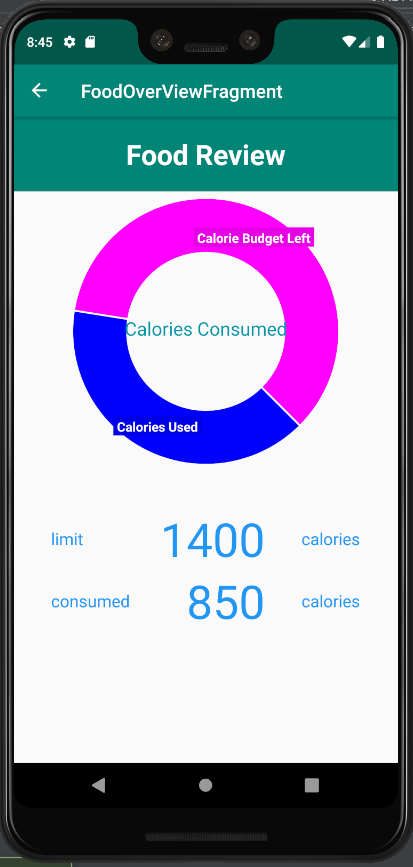
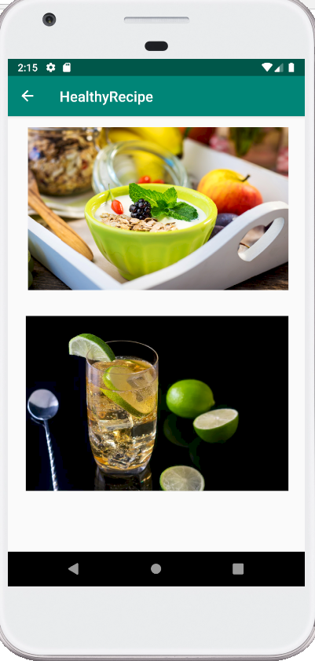
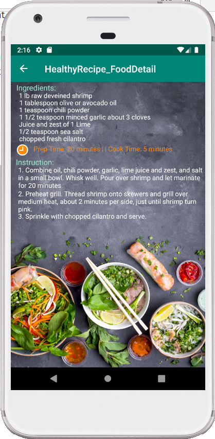
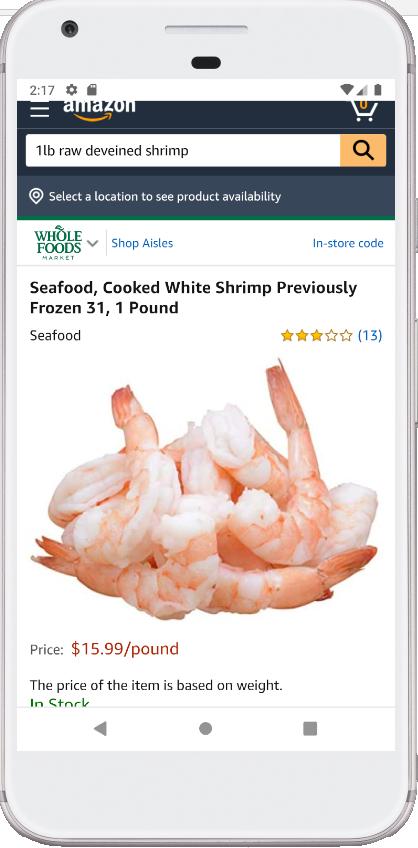

# Diet-Android-App
First Document 

## Introduction:
The purpose of the Calorie Counter Fragment is to provide a way for users to register what they have eaten throughout the day and track at
what time they ate to ensure that users know what they are eating to promote healthier living.

The purpose of healthy recipe fragment is to provide users with some good recipes so that they can easily follow and learn how to make healthy foods

## Motivation:
Most diet apps restrict you on what you can track and sometimes provide too many options on what to track for certain foods, the calorie fragment is meant to provide a very simple way for users to enter what they ate and record at what time of the day they ate in order to provide a simple tracking of calories.

Healthy recipe fragment provide nice looking and easy-to-learn meals to ensure users are motivated to maintain a healthy diet

## Code style:

Kotlin was used to make all the files associated with the calorie fragment

## Features:
The calorie fragment provides a easy to use interface that allows users to simply to click on a button that takes them to a entry
point and lets users enter what they ate and then see at what time the food was eaten.

The Healthy Recipe Fragment provides the healthy food recipes that can help users to reach and maintain healthy weight and reduce risk of diseases. User can easily learn how to make the food and buy the ingredients by clicking them. (For healthy drink just click the picture)

## Screenshots

## Some Libraries Used
1. Room: https://developer.android.com/topic/libraries/architecture/room
2. Recyclerview: https://developer.android.com/reference/android/support/v7/widget/RecyclerView
3. LifeCycle: https://developer.android.com/topic/libraries/architecture/lifecycle
4. HelloCharts: https://github.com/lecho/hellocharts-android

Kevin Delao: Calorie Counter Fragment, AddFoodFragment, FoodOverview Fragment

Yilin Ruan: Healthy Food Recipe

Kuong Thong: Notifications

Nicholas Torres: Records Fragment

Thyagu Gowda: Exercise Fragment
